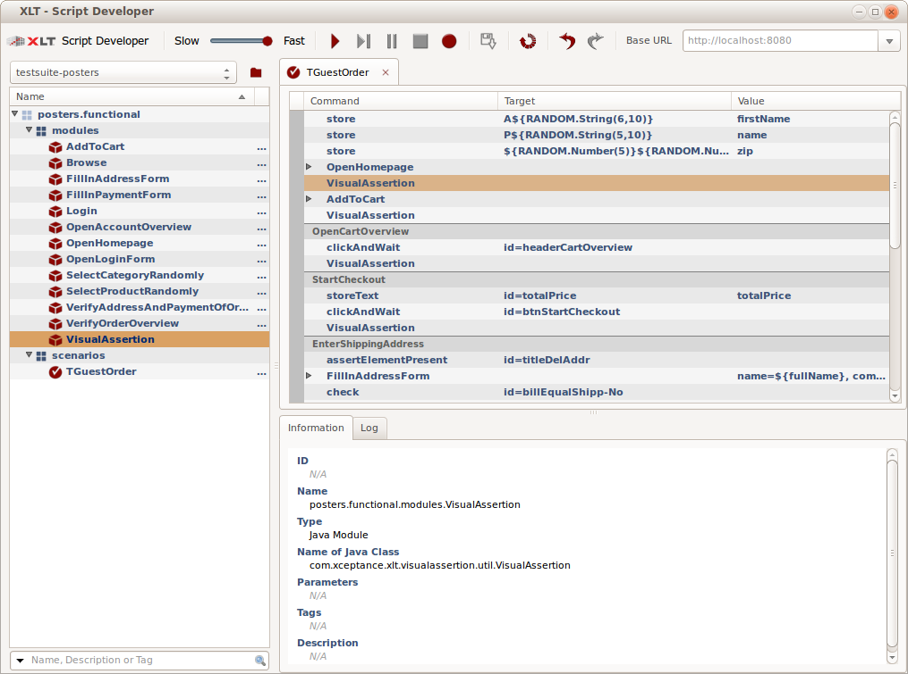
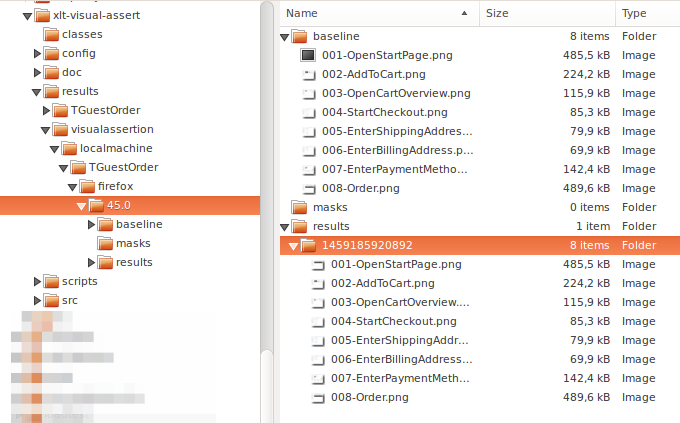
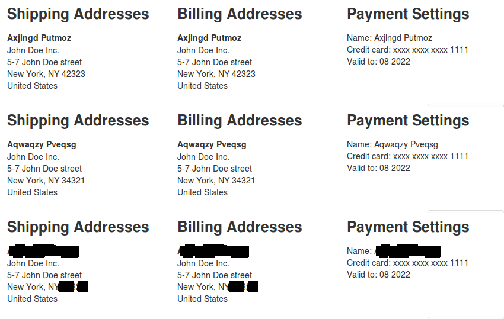

Visual Regression Testing with XLT
==================================

Introduction
------------

XLT is a tool for functional test automation as well as load and performance testing. This test suite is meant to be the base for functional test automation with visual verification and can be easily combined with any existing XLT test suite you might already have (see: https://github.com/Xceptance/SiteGenesis-Community-TestSuite).

### Validation

Validation is essential for test automation. Do not simply click around and as long as buttons and form fields are there, you are happy, really verify the content of the page that it matches your expectations.

Well of course this creates a certain dilemma. The more you validate, the more eaily does you test suite break just because of smaller changes. But the less you validate, the fewer regressions you find and the more you might get the wrong impression of the quality of your implementation.

Normal test automation usually does not verify visually, it just verifies content or certain properties of elements. So you will see that a button disappeared, but you are not going to see that the button is suddenly right-aligned instead of left, larger or smaller, or maybe changed its color.

**Visual regression testing to the rescue!**

You might have already read about using Selenium for this: [Visual Regression Testing with PhantomCSS](https://css-tricks.com/visual-regression-testing-with-phantomcss/), [Catch CSS curve balls](https://garris.github.io/BackstopJS/), or [CSS regression testing](https://github.com/Huddle/PhantomCSS).

We got inspired by these ideas but wanted to take the idea a little further.

### The Base Idea
This test suite offers a way to take a screenshot, organize for later, train masks for data that is changing all the time, and compare the baseline to the screenshots with applied masks during future runs.

Features
--------
This is a list of the test suite features you can use to visually verify your implementation during automated testing.

* *Screenshots*: The suite takes screenshots where the visual assertion module is inserted. These can be different from the regular screenshot automatically taken by XLT or in case you switched automatic screenshoting off, could be the only area where you take a visual look.
* *Any Browser*: Supports any browser that can take screenshots and is supported by Webdrivers (see [Multi-Browser-Suite](https://github.com/Xceptance/multi-browser-suite)).
* *Difference Image*: Creates a difference image to easily see the changes.
* *Marked Image*: Created image with markings to highlight the change area in the screenshot (there are two ways to mark things).
* *Trainings Mode*: Learns dynamic areas of the screen to automatically black them out/mask them, such as names, search phrases, addresses, and so forth. You can manually update the mask to include other areas as well.
* *Thresholds*: The fuzzy modes support thresholds to control the sensitivity of the comparison.
* *Compare Modes*: Visual Assert features three modes to compare: Exact, Color Fuzzy, and Fuzzy.
* *Open Source*: See and improve the code, share it with others. MIT license.

Getting Started
-----------
### Download XLT

This test suite requires that you download XLT from https://www.xceptance.com/en/xlt/. Don't be shy, it is freely availble for test automation purposes, we don't even ask for you email. Make sure you download the full package. The XLT Script Developer alone is not sufficient.

### Basics

Learn the basics how to automate with XLT before you take it to the next level with Visual Assertions. Please study the [user manual](https://lab.xceptance.de/releases/xlt/latest/getting-started/01-test-automation.html) and take a look at the installation and configuration part of the [SiteGenesis-Community-TestSuite](http://xceptance.github.io/SiteGenesis-Community-TestSuite/).

Demo
----
We will use the bundled demo applications *Posters* to demonstrate how visual assertions work and can be used.

* *Posters*: So fire up the *Posters* test suite and open this test suite in your XLT Script Developer.
* *Demo Test Case*: You will find a slightly modified copy of the TGuestOrder test case of the XLT demo test suite Posters under ```posters > functional > scenarios```.
* *VisualAssertion Module*: Check ```posters > functional > modules > VisualAssertion```. This module is a Java module that will later on take care of calling the Java class  ```com.xceptance.xlt.visualassertion.util.VisualAssertion``` that does the heavy lifting. Please note that this module won't be executed in Script Developer. You have to run it as a JUnit test.



* Now import the test suite into Eclipse or any other of your favourite IDEs. Make sure you follow the guides already mentioned before to get it working.
* Open ```src/posters/functional/scenarios/TGuestOrder.java```. This is the JUnit test we are about to execute. It references the script we designed before, so it is supposed to look pretty empty.
* Run it as JUnit test. The test suite should be configured to open Firefox and run the test case.
* Check the ```results``` folder of your test suite and you will find the usual result browser folder ```TGuestOrder``` and ```TGuestOrder.html``` with the default screenshots.

So let's get to the interesting pieces that differenciate this test suite from any other. There is now a folder called ```visualassertion```.  

Result Structure
----------------
The directory structure underneath the ```visualassertion``` is composed of subdirectories and files. Please see this example.



* *localmachine*: This is a subdirectory name you can specify in the properties to distinguish your machine from others. See [Challenges and Pitfalls](Challenges and Pitfalls).
* *TGuestOrder*: This is the test case you just executed.
* *firefox*: The browser used, because different browser render screens differently. The Webdriver interface does not tell us the OS, so we have to use the first directory to differenciate this.
* *45.0*: The version of Firefox used. Even small version changes of a browser change the way it renders the page. This is mostly very hard to spot by the human eye.

Config
------
### Property File
Visual assert has its own config file ```visualassertion.properties```. The project property file ```project.properties``` includes it with the statement:

```
com.xceptance.xlt.propertiesInclude.1 = visualassertion.properties
```

If you include other files using the same mechanism, please make sure you change the number ```1``` to the next valid one.

### Properties
The file lists a couple of important properties we want to discuss next. The full property documentation is part of the property file itself.

#### Algorithms
You can pick from three algortihms right now. Exact, color fuzzy, and fuzzy. See the details below.

#### Trainings Mode
If you set this to true, the suite will learn masks and not raise assertion failures.

#### Mask closing
If you have masks that are open, this setting can help to close them and cover a larger area by that.

#### Mask Size
The mask size determines how much black is applied to every detected difference. The default is 10x10 pixels. So the mask covers an area of 10x10 for every different pixel but of course, the masked spots can overlap, so two adjoined pixels will create a 10x11 mask.

Basic Usage
-----------
### General
To utilize visual verification best, we suggest to either create a dedicated test case or either copy one of your most important ones and modify it. Most important is that you add dedicated points where visual verification should take place.

This places should symbolze typical screens and don't too much data the moves visually such as sliders or tickers. Please keep in mind that the screenshots and the comparisons take time hence do not add too many verification points.

### Dry-Run
After the first training round, you should verify the screen shots taken and see if there are about correct. Visually inspect them before you start to train the masks.

### Training
In the next step, you let the test cases run often in training mode and let the tool create the masks. Depending on the amount of changing data and its structure, one run could be enough or you might have to run it as often as 10 times.

Also try to play with the mask closing setting as well as closing size in case you do not achieve satisfying training results.

### Verification of Masks
You might not want to trust the masks blindly in the first place. Especially mask that are set but you do not expect any mask to be there. This indicates application or test cases issue in most cases.

### Test Runs
Disable the training mode and start running some tests to verify that the masks are properly trained and nothing unexpected comes up.

### Verify CI
Because the baseline images can be different when you run your the tests in your CI environment compared to your local machine, you might want to activate training for some runs. Make sure the application under test does not change. Once the masks here are set as well as the inital baseline screenshots, you can disable training mode and see how it works out.

Algorithms in Detail
--------------------
### Exact
Any difference will be reported.

### Fuzzy
The fuzziness is reached by tolerating a small amount of pixels being different for every small block in the picture. The property ```com.xceptance.xlt.visualassertion.fuzzy.blocksize.xy
``` determines the size of each of these blocks. The entire screenshot will be divided into these blocks.

So when you have 10x10 blocks, a fuzzy factor (```com.xceptance.xlt.visualassertion.tolerance.pixels```) of 0.1 indicates, that 10% of the pixels can be different. So we will tolerate a difference of 10 pixels in total for this area.

### Color Fuzzy
The color comparison used an idea from http://www.compuphase.com/cmetric.htm to include the human factor. So smaller color differences yield smaller percentage values than larger differences. Play with the settings to see what fits best.

Training and Masks
------------------
Let's talk about masks and training quickly. When you have test case with variable data and you definitivly should have these, the screenshots are often different. Data is displayed (names, prices, emails) and so every comparison will fail.

The trainings mode will automatically created masks so that data variance matters less. Of course there are limits to what masking can do, but we will discuss this later.

Here is an example. You see two examples of different data and how one pass of masking has blackend it.



By varying the size of the mask box (```...mark.blocksize.x``` and ```...mark.blocksize.y```) you can adjust the amount of masking per trainings run. Don't make it too big to avoid covering unchanging areas and don't make it too small, because you will need a lot of passes to get the masks trained and your test cases stable.

Updating
--------
### Browsers
If your browser changes, visual assert is automatically taking care of that and starting a new subdirectory. You might want to train it afterwards again.

### Application under Test
If you update your application under test and the changes of the screens are legit, you have to redo the baseline screenshots and the masks.

Simply delete the baseline directory and the masks or use a new identifier (```com.xceptance.xlt.visualassertion.ID```). Make sure you don't forget to train it again. Because the application has changed, you probably cannot reuse the old masks.

If you know the screen that changed, you can only clear this data and keep the rest.

#### Test Case Changed
If you test case changed and hence naming and numbering of the screenshots, you should remove all previous screenshot baseline and masks after the changed position, including the new position of course.

You can reuse all baseline screenshot before, because their name and number is still the same.

Challenges and Suggestions
-----------------------
### Screenshots Keep Changing
If screenshots keep changing when you run the test multiple times and the library starts to mask pixel in strange areas during training, you might see problematic subpixel alias handling by Windows. The ClearType font rendering seems to introduce sporadic pixel failures.

Make sure that baseline, masking, and later runs are done on the same machine, same OS, and same browser version to prevent typical problem due to rendering difference on OS or browser level. Later version of this library might solve this problem or if you like, solve it and send us a pull request.

### Masking
Because the masking excludes changing areas, you might want to pick screens that don't tend to be masked out totally. For instance when your homepage is content heavy and changes often, you get a header section only and the rest is masked. The header is probably identical to other pages.

### Edit Masks
You can edit the masks and simply add areas manually in case the training takes too long or is not precise enough.

### Differences in Size
Differences in size cannot be masked, hence a changing screenshot size will always cause asserations failures.


Misc
====
This test suite is work in progress and we are looking for active participlation and ideas.

Future adaptions and aditions to the comparison algorithms are planned, which allow for a more consistent page comparison, that adjusts better to dynamic content changes.
